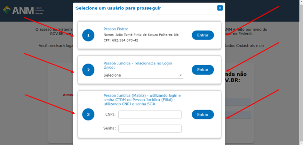

Consigo acessar tanto a minha pessoa física quanto pessoa jurídica no mesmo login?
==========================================================

Sim! Existem duas formas de se fazer isso.
Opção 1: Após o login, imediatamente aparecerá uma tela pedindo para que você selecione um usuário para prosseguir com o seu Requerimento de Pesquisa.

Opção 2: No canto superior direito da tela de início do portal, há um campo de texto no qual você consegue alterar o seu representante. Lá, estarão todos os seus representados (caso haja mais de um). Ao operar a troca, caso esteja alterando seu representante como uma Pessoa Física para uma Pessoa Jurídica, os campos de Nome e CPF mudarão para Razão Social da Empresa e CNPJ, respectivamente. E vice-e-versa.

