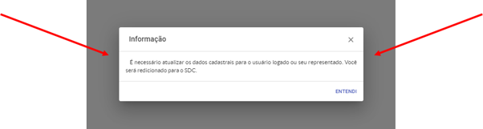

Quando faço o login no Sistema de Requerimento de Pesquisa aparece uma aba dizendo que preciso atualizar os meus dados no SDC. Consigo acessar o portal sem fazer a atualização?
=================================================

Não. Você precisa atualizar as suas informações antes de seguir adiante. Isso serve para que a ANM tenha total transparência no processo de Solicitação de Requerimento de Pesquisa.

