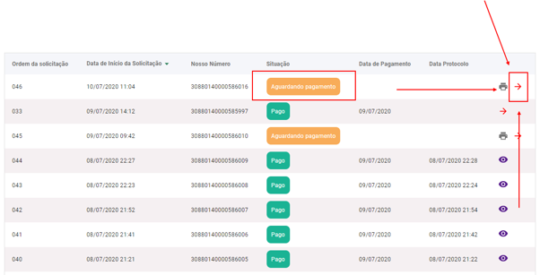
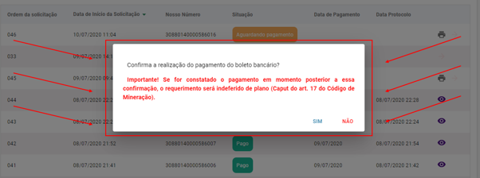

Posso concluir o Requerimento de Autorização de pesquisa antes de efetuar o pagamento do boleto?
================================================

Não. Uma vez que o fluxo do requerimento não pode ser salvo e o pagamento é o primeiro passo para a conclusão do fluxo, mesmo que ele seja concluído, mas sem o pagamento prévio do boleto, haverá indeferimento de plano.

