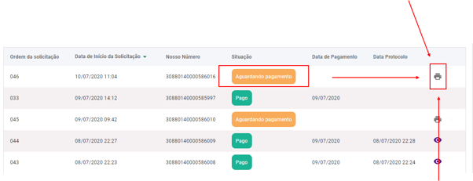

Preciso imprimir novamente o meu boleto. Como faço isso?
=========================================================================================

Simples! Vá na sua lista de Solicitações, e selecione o ícone de impressão no canto direito do Requerimento que você deseja reimprimir. Feito isso, o sistema irá te gerar um boleto e o mesmo aparecerá em sua tela.

