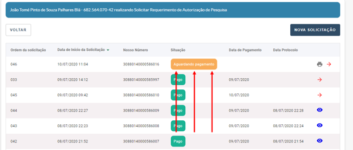

Nova solicitação/ Pagamento do boleto
=======================================================================

3.1) O que acontece depois que faço uma Nova Solicitação?
-----------------------------------------------------------------------

Ao realizar uma Nova Solicitação de Requerimento de Autorização de Pesquisa Mineral, a Solicitação aparecerá no topo da lista de Requerimentos com a situação de “Aguardando Pagamento”. 

3.2) Quanto tempo leva para o sistema reconhecer que o boleto foi pago?
-----------------------------------------------------------------------

Após o pagamento do boleto, o sistema leva, normalmente, dois dias úteis para atualizar a Situação do seu boleto para “Pago”. 

3.3) Posso começar a preencher o meu Requerimento de Autorização de Pesquisa Mineral e finalizá-lo depois?
-----------------------------------------------------------------------

Não. Caso você pare o fluxo da sua solicitação no meio do caminho, a mesma não será salva. Será necessário repetir todo o processo. O requerimento apenas é protocolizado após a conclusão no Item 05 - Conclusão.

