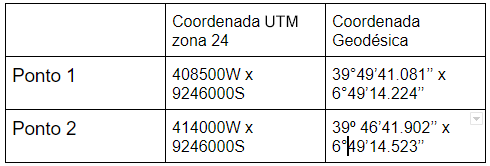
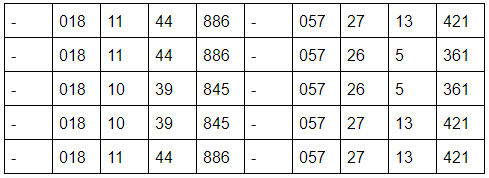
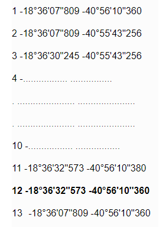
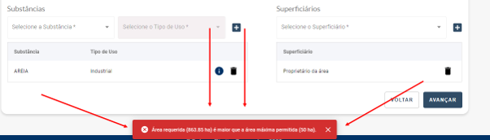
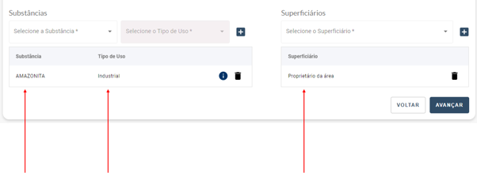

Inserindo Poligonal “Área”
=======================================================================

3.1) Como insiro a Longitude e Latitude dos locais que desejo fazer a minha pesquisa?
-----------------------------------------------------------------------

As coordenadas só poderão ser incluídas se estiverem exatamente com rumos NS/EW.
 
De acordo com esta norma, a latitude ou a longitude de um ponto deve ser igual ao ponto anterior. A coordenada em negrito repete a coordenada anterior como o exemplo logo abaixo.
 
(1) -18°36'07''809 -40°56'10''360
(2) -18°36'07''809 -40°55'43''256
(3) -18°36'30''245 -40°55'43''256
 
Se uma das coordenadas não estiver idêntica à do ponto anterior, o sistema vai negar a entrada do novo ponto. É necessário a inclusão de cinco coordenadas.
As coordenadas geodésicas estão alinhadas segundo o Norte Verdadeiro, enquanto as coordenadas UTM estão alinhadas segundo o Norte da Quadrícula. Por este motivo, considerando dois pares de coordenadas UTM com o Norte ou Leste fixo, ao efetuar a conversão UTM para geodésica, os valores dos décimos, centésimos e milésimos de segundo vão necessariamente variar para as coordenadas UTM fixas, conforme observado no exemplo abaixo.

Para entrar com os dados no sistema será necessário ajustar os valores dos décimos, centésimos e milésimos de forma que sejam iguais entre os dois pontos.

3.2) Formato das coordenadas 
-----------------------------------------------------------------------

É necessário que o formato das coordenadas esteja igual ao do exemplo abaixo, com todas as casas decimais exibidas. Caso as três casas depois do ponto não sejam incluídas, o programa vai recusar a entrada da coordenada.
Exemplo:
014º 52’26.000 x 052º 50’50.000’’
 

3.3) Formato do arquivo .csv com a poligonal da área
-----------------------------------------------------------------------

Para criar o arquivo no Excel (.csv) é necessário formatar as colunas como texto. Se as colunas estiverem formatadas como “número” ou “geral” o Excel vai apagar os zeros à esquerda, necessários para manter os três números no grau e dois números nos minutos e segundos. O arquivo deve conter uma coluna com o sinal e as demais com os graus, minutos, segundos e milésimos em colunas separadas. Segue o exemplo do arquivo no Excel:
(tabela 1):

Muitas vezes, mesmo o arquivo estando correto, o programa apresenta uma mensagem de erro informando que “não foi possível carregar porque a linha estava incorreta - ;;;;;;; ”. Isto acontece porque o Excel pode considerar as colunas adjacentes em branco como sendo parte do arquivo. Se isto acontecer, selecione diversas colunas abaixo e ao lado dos números incluídos e delete estas colunas.
O ideal é abrir o arquivo .csv no bloco de notas para verificar se o problema aparece. No exemplo abaixo, veja que o Excel manteve dados na linha após o preenchimento dos números. Esta linha precisa ser eliminada. O arquivo .csv pode ser salvo em formato .txt para ser importado no pré requerimento. É possível também criar um arquivo .txt diretamente no bloco de notas, Word, ou programas similares, com o formato mostrado abaixo.
Exemplo:
Notar o erro ao final deste arquivo (;;;;) resultante da presença de dados nulos no Excel. Quanto isto acontecer, apagar os ponto e vírgulas da última linha.

.. image:: ../imagens/imagem17.png

3.4) Incluir coordenadas usando arquivo .GPX
-----------------------------------------------------------------------

Para adicionar coordenadas usando arquivo .GPX segue a mesma regra dos rumos NS/EW, a coordenada deve ser idêntica ao ponto anterior e a coordenada do primeiro ponto deve ser igual ao do último, entretanto o arquivo tem que estar como polígono. Se o arquivo estiver com pontos não será aceito.

3.5) Incluir um último ponto igual ao primeiro ponto
-----------------------------------------------------------------------
Ao finalizar a poligonal é necessário que o último ponto seja igual ao primeiro, para que o polígono seja fechado. Algumas vezes, com o ajuste dos décimos de segundos, ao final da poligonal não se consegue incluir um último ponto igual ao primeiro, já que não existe nenhuma coordenada comum entre eles. Neste caso será necessário incluir um ponto intermediário, conforme exemplo abaixo, para depois adicionar o ponto final.
Exemplo inclusão ponto intermediário:
A poligonal deste exemplo terminava no ponto 11. Neste caso, nenhuma das coordenadas (latitude ou longitude) é igual ao ponto 1. Inclui-se então o ponto 12, mantendo uma das coordenadas igual à do ponto 12 (no exemplo, a latitude) e modificando a outra coordenada para que fique igual à do ponto 1 (no exemplo, a longitude). Feito isto, basta incluir o último ponto igual ao primeiro (no exemplo, ponto 13).

3.6) É possível solicitar uma substância com um determinado tipo de uso que tenha uma área máxima menor que a área requerida?
-----------------------------------------------------------------------

Não. Não é possível requerer uma área de Substancia X Tipo de uso que seja menor do que a área máxima permitida.

3.7) A área na qual quero fazer o meu Requerimento de Pesquisa está ocupada. Como o sistema vai proceder nesse caso?
-----------------------------------------------------------------------

Se for uma área ocupada, o sistema vai criar o processo e o direciona a caixa SEI da Unidade Regional que é responsável por aquele processo (a UF é a predominante que você selecionou), o que tirará o seu processo da esteira automática da ANM.
Caso, durante o preenchimento do Requerimento a área que você você estava solicitando passou de livre para ocupada, a sua solicitação será enviada para a Análise do Controle de Áreas da ANM e seu prazo de atendimento será superior aos 34 dias úteis.

3.8) É obrigatório adicionar as Substâncias e um Superficiário para seguir adiante com o processo do Requerimento?
-----------------------------------------------------------------------

Sim. É obrigatória a inserção de pelo menos uma Substância (informando o tipo de uso) e de um Superficiário.

