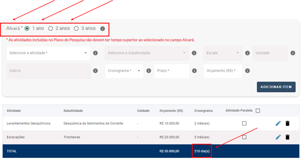
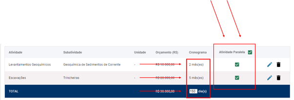

Plano de Pesquisa
=======================================================================

3.1) Não estou conseguindo seguir adiante na fase Plano de Pesquisa. Por quê?
-----------------------------------------------------------------------

Opção 1: São necessárias ao menos 2 (duas) atividades no Plano de Pesquisa e que não sejam do tipo 'Outros' para prosseguir.

.. image:: ../imagens/imagem13.png

Opção 2*: A duração das atividades incluídas no Plano de Pesquisa não deve ser superior ao tempo selecionado no campo Alvará. Como vemos no exemplo abaixo, selecionamos no campo Alvará 1 ano, e recebemos como resultado no campo total na coluna Cronograma, o valor de 210 dias mediantes às atividades adicionadas. A coluna Cronograma do campo Total, deve ser inferior ou igual ao campo selecionado Alvará.

*OBS: Se for o caso, é possível indicar as atividades que serão feitas paralelamente. Com isso, os 210 dias (7 meses) que estão no cronograma da imagem acima, passarão a ser 150 dias (5 meses).

