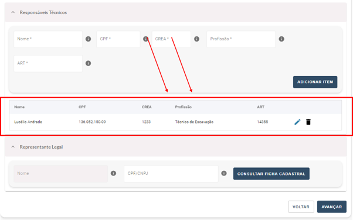

Documentação Obrigatória
=======================================================================

3.1) Quem eu preciso incluir na Documentação Obrigatória?
-----------------------------------------------------------------------

Será necessário a inclusão de pelo menos um Responsável Técnico para a realização do Requerimento.

3.2) Quais documentos de terceiros eu preciso para que possa realizar a Solicitação de Requerimento de Autorização de Pesquisa?
-----------------------------------------------------------------------

Responsável Técnico*: Nome, CPF, CREA, Profissão e ART (única por requerimento). 
*OBS: Caso haja mais de um responsável técnico, não será possível repetir CPF, CREA nem ART.
Representante Legal (caso haja): Nome, CPF/CNPJ 

3.3) Preciso ter um Representante Legal para realizar a Solicitação de Requerimento?
-----------------------------------------------------------------------

Não, apenas é obrigatório a inserção de pelo menos um Responsável Técnico do projeto.